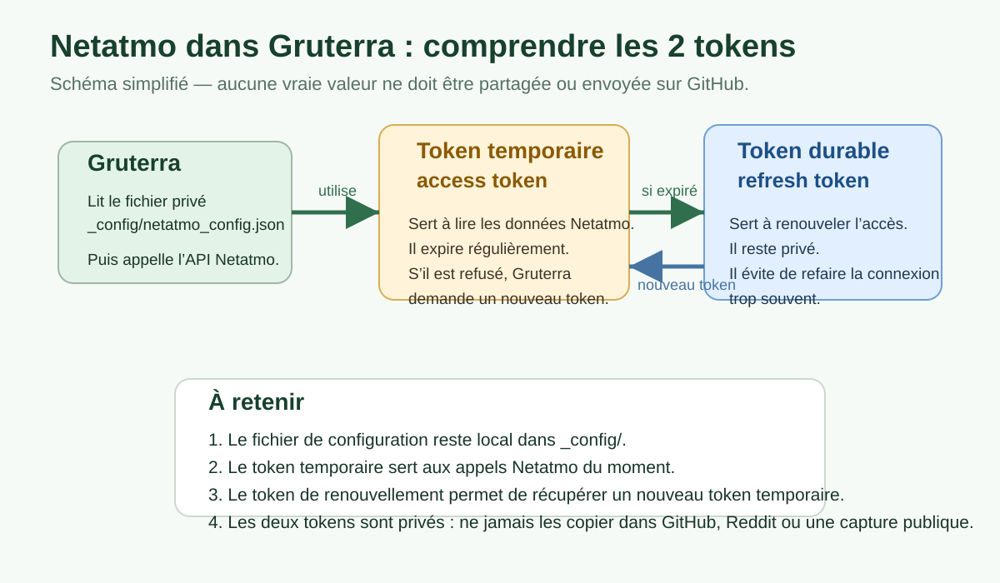

# Configurer Netatmo dans Gruterra

Ce guide explique comment préparer une future station Netatmo pour Gruterra.

Gruterra ne doit jamais recevoir ni publier vos vrais tokens. Les identifiants Netatmo restent dans un fichier privé local, exclu de GitHub.

## Ce que Gruterra peut afficher

Avec une configuration Netatmo valide, Gruterra peut afficher :

- les équipements Netatmo privés du compte ;
- les modules associés, par exemple intérieur, extérieur, pluviomètre ou anémomètre selon le matériel disponible ;
- les stations publiques proches d’un point approximatif ;
- des stations publiques favorites ajoutées par identifiant ou lien weathermap ;
- une synthèse météo locale avec température, humidité, pression, pluie, vent et rafales quand les données existent ;
- une prévision locale courte si la configuration météo complémentaire est disponible.

## Fichier privé à créer

Le fichier à créer est :

```text
_config/netatmo_config.json
```

Ce dossier est exclu de GitHub. Il doit rester local à votre machine.

Un modèle public existe :

```text
netatmo_config.example.json
```

Copiez ce modèle vers `_config/netatmo_config.json`, puis remplacez les valeurs d’exemple par vos propres valeurs.

## Exemple de fichier

```json
{
  "client_id": "votre_client_id_netatmo",
  "client_secret": "votre_client_secret_netatmo",
  "access_token": "votre_access_token_netatmo",
  "refresh_token": "votre_refresh_token_netatmo"
}
```

Ne copiez jamais ce fichier dans une discussion publique, une issue GitHub ou un commit.

## Schéma simple des deux tokens



## À quoi servent les champs

### `client_id`

Identifiant public de l’application créée sur le portail développeur Netatmo.

### `client_secret`

Secret associé à l’application Netatmo. Il doit rester privé.

### `access_token`

Token temporaire utilisé pour appeler l’API Netatmo.

### `refresh_token`

Token permettant à Gruterra de demander automatiquement un nouvel `access_token` quand l’ancien expire.

C’est le champ le plus important pour éviter de devoir se reconnecter trop souvent.

## Création côté Netatmo

Le parcours Netatmo peut changer, mais l’idée générale est :

1. Aller sur le portail développeur Netatmo.
2. Se connecter avec le compte Netatmo.
3. Créer une application.
4. Récupérer le `client_id` et le `client_secret`.
5. Obtenir un `access_token` et un `refresh_token` pour ce compte.
6. Placer ces valeurs dans `_config/netatmo_config.json`.
7. Lancer Gruterra et utiliser **Actualiser Netatmo**.

Si Netatmo modifie son portail ou bloque une authentification, le problème peut venir du compte Netatmo, du portail développeur ou d’un token expiré.

## Stations publiques favorites

Gruterra peut aussi suivre des stations publiques favorites.

Dans l’interface, vous pouvez coller :

- soit un identifiant de station Netatmo ;
- soit un lien weathermap complet contenant `stationid=`.

Exemple de forme acceptée :

```text
https://weathermap.netatmo.com/?stationid=XX:XX:XX:XX:XX:XX
```

Gruterra extrait l’identifiant, l’ajoute à la configuration locale, puis l’affiche dans les favoris après une actualisation Netatmo.

## Position approximative

Pour les stations publiques proches, Gruterra utilise une position approximative stockée dans la configuration locale de l’application.

Il est préférable d’utiliser un point à plusieurs centaines de mètres du domicile plutôt que l’adresse exacte.

## Messages d’erreur fréquents

### `Aucun access_token`

Le fichier `_config/netatmo_config.json` existe peut-être, mais le champ `access_token` est vide ou absent.

### `Aucun refresh_token`

Gruterra ne peut pas renouveler automatiquement l’accès Netatmo. Il faut obtenir un nouveau `refresh_token`.

### `Erreur OAuth Netatmo`

Les identifiants OAuth sont probablement invalides, expirés ou refusés par Netatmo. Vérifiez `client_id`, `client_secret` et `refresh_token`.

### `Erreur Netatmo 503`

Netatmo indique que le service est temporairement indisponible. Gruterra doit continuer à fonctionner sans bloquer les autres données.

### Aucune station publique affichée

Causes possibles :

- position approximative absente ;
- rayon de recherche trop faible ;
- aucune station publique disponible autour du point choisi ;
- token Netatmo invalide ;
- service public Netatmo temporairement indisponible.

## Vérification avant GitHub

Avant tout envoi GitHub, lancez la vérification locale :

```powershell
py verifier_avant_github.py
```

Puis, pour un audit plus complet :

```powershell
py audit_botaneo.py
```

Ces scripts vérifient notamment que les fichiers sensibles ne sont pas prêts à partir vers GitHub.

## À ne jamais publier

Ne publiez jamais :

- `_config/netatmo_config.json` ;
- un `client_secret` ;
- un `access_token` ;
- un `refresh_token` ;
- une base SQLite réelle ;
- une position exacte de domicile.

## État actuel de l’intégration

L’intégration Netatmo est utilisable, mais la configuration reste encore manuelle.

À améliorer plus tard :

- écran de configuration Netatmo dans Gruterra ;
- bouton dédié pour tester la connexion Netatmo ;
- aide plus claire quand un token est invalide ;
- assistant guidé pour ajouter une station publique favorite ;
- meilleure documentation du flux OAuth si Netatmo stabilise son portail développeur.
