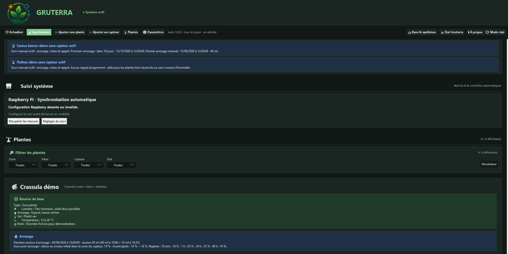
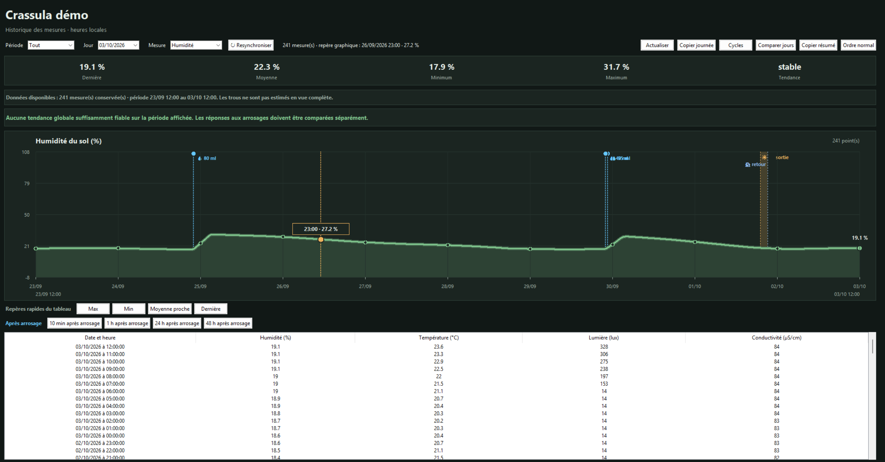
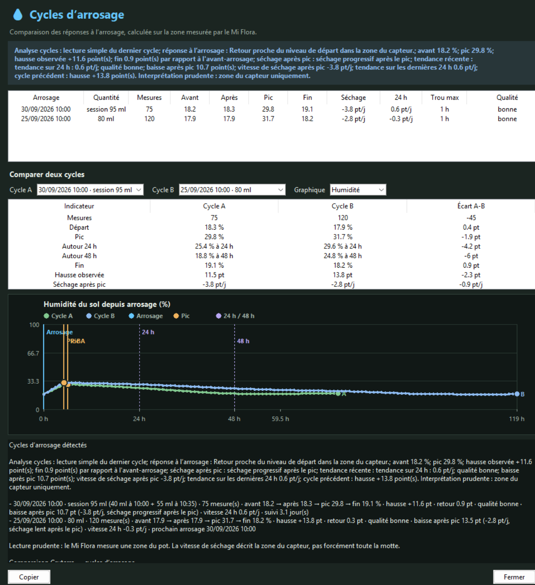

# Gruterra

English entry point: [README_EN.md](README_EN.md) · Demo guide: [GUIDE_DEMO_EN.md](GUIDE_DEMO_EN.md)


Gruterra est une application locale de suivi des plantes. Elle aide à centraliser les plantes, les mesures Mi Flora, l’historique, les arrosages, les rappels, la météo locale et les premières analyses de cycles d’arrosage.

Le projet est né d’un besoin simple : ne pas seulement afficher des mesures, mais comprendre ce qui se passe pour une plante au fil du temps. Par exemple : est-ce qu’un arrosage a réellement fait monter l’humidité dans la zone du capteur ? Combien de temps faut-il pour revenir au niveau de départ ? Est-ce qu’une journée lumineuse vient d’une vraie exposition ou seulement d’un pic ponctuel ?

> Nom officiel du projet : **Gruterra**. Certains fichiers, variables d’environnement, services Raspberry et chemins conservent encore le nom technique historique `botaneo` pour préserver la compatibilité avec les installations existantes.

## Tester rapidement sans matériel

Le plus simple pour découvrir Gruterra est le mode démonstration. Il ne demande ni capteur Mi Flora, ni Raspberry Pi, ni compte Netatmo, ni base personnelle.

```powershell
py -m pip install -r requirements.txt
py Lancer_Demo.py
```

Le guide détaillé est ici : [GUIDE_DEMO.md](GUIDE_DEMO.md). Pour installer depuis une archive ZIP de release, voir [GUIDE_INSTALLATION.md](GUIDE_INSTALLATION.md).

## Démo ou utilisation réelle ?

- `Lancer_Demo.py` ouvre Gruterra avec des plantes et mesures fictives. C’est le meilleur choix pour découvrir le projet sans matériel.
- `Lancer_Gruterra.py` ouvre Gruterra pour une utilisation réelle, avec une base locale vide au départ. Vos futures données restent sur votre machine.

Les deux lanceurs sont à la racine du dossier Gruterra et utilisent des chemins relatifs au dossier décompressé.

## Aperçu de la démo

Les captures ci-dessous utilisent uniquement les données fictives du mode démo.

### Accueil



### Historique des mesures



### Comparaison des cycles d’arrosage



## Ce que Gruterra sait déjà faire

- Suivre des plantes avec ou sans capteur actif.
- Associer un capteur Mi Flora à une plante.
- Lire les mesures Mi Flora : humidité du sol, température, luminosité, conductivité, batterie.
- Importer l’historique interne Mi Flora sans effacer les données du capteur.
- Afficher un historique graphique avec qualité des données, repères d’arrosage et sélection de journée.
- Enregistrer des arrosages manuels, des rappels et des observations.
- Analyser les cycles d’arrosage : humidité avant, pic, 24 h, 48 h, retour au niveau de départ et qualité des mesures.
- Distinguer les sorties balcon / retours intérieur pour contextualiser la lumière.
- Afficher les besoins de base d’une plante depuis une mini base locale.
- Afficher Netatmo privé/public et une synthèse météo locale quand la configuration existe.
- Synchroniser avec un Raspberry Pi optionnel pour récupérer les mesures plus régulièrement.
- Préparer une vérification de mise à jour GitHub non destructive.

## État du projet

Gruterra est en développement actif. L’application fonctionne déjà en local pour un usage personnel, mais l’installation pour d’autres utilisateurs est encore en cours de stabilisation.

Priorités actuelles :

- améliorer la lisibilité de l’historique et des cycles d’arrosage ;
- renforcer le mode démo pour tester le projet sans matériel ;
- préparer une mise à jour guidée sans risque pour les données personnelles ;
- documenter plus clairement l’installation Raspberry Pi ;
- garder les secrets, bases réelles et configurations privées hors du dépôt.

La roadmap courte est dans [ROADMAP.md](ROADMAP.md). Le fichier [TODO.md](TODO.md) garde l’historique détaillé du développement.

## Données personnelles et sécurité

Gruterra est pensé pour fonctionner localement. Les fichiers personnels suivants ne doivent pas être publiés :

- base SQLite réelle ;
- dossier `_config/` ;
- tokens Netatmo, Météo-France ou e-mail ;
- favoris locaux ;
- sauvegardes ;
- caches runtime et données collectées.

Le dépôt fournit seulement des fichiers d’exemple anonymes.

## Audit local avant envoi GitHub

Une commande permet de lancer les contrôles principaux sans capteur :

```powershell
cd <dossier Gruterra décompressé>
py audit_botaneo.py
```

Elle exécute les tests automatisés, la vérification avant GitHub, un contrôle du diff Git et affiche les fichiers encore modifiés à relire avant commit. La couverture détaillée est décrite dans [tests/README.md](tests/README.md).

## Fonctionnalités principales

- Interface graphique Tkinter.
- Interface console.
- Suivi de plantes avec ou sans capteur actif.
- Association d’un capteur Mi Flora à une plante.
- Lecture Bluetooth Mi Flora avec plusieurs tentatives de scan.
- Enregistrement des mesures dans SQLite.
- Historique des mesures avec vue graphique.
- Mini base de plantes avec autocomplétion.
- Besoins de base par plante : lumière, arrosage, sol, température.
- Arrosage manuel et rappel programmable.
- Centre d’alertes local : batterie, rappels, données anciennes, météo proche.
- Intégration Netatmo privée et publique.
- Synthèse météo locale à partir des meilleures données disponibles.
- Prévision locale à environ +2 h.
- Mode sombre et options d’affichage.
- Fenêtre `À propos` avec version locale, chemins utiles, état Raspberry et rappel sécurité.
- Sauvegarde locale du projet vers un ou plusieurs disques.

## Installation

Gruterra nécessite Python 3.14 ou une version compatible.

Installer les dépendances :

```powershell
py -m pip install -r requirements.txt
```

Si le lanceur `py` n’est pas disponible, utiliser l’exécutable Python installé sur le PC.

Tkinter et SQLite sont fournis avec une installation Python Windows standard.

## Lancement

Interface graphique :

```powershell
py Lancer_Gruterra.py
```

Interface console :

```powershell
py _app\app.py
```

Pour un raccourci Windows, pointer vers `Lancer_Gruterra.py` ou `Lancer_Demo.py` à la racine du dossier Gruterra.

## Langue et traduction

Gruterra est pour l'instant un projet principalement francophone. L'interface, les analyses métier et une partie importante de la documentation sont d'abord rédigées en français.

L'anglais est accueilli pour GitHub, Reddit et Discord, mais la traduction complète de l'application n'est pas encore terminée. Les contributions de traduction seront possibles plus tard, après stabilisation des textes et de la structure de l'interface.

## Mode démo

Le mode démo permet de tester l’interface sans capteur Mi Flora, sans compte Netatmo et sans base personnelle. Il crée une base SQLite fictive dans `_app/data/demo/plantes_demo.db`, avec quelques plantes, mesures, arrosages et observations d’exemple.

```powershell
py Lancer_Demo.py
```

La base démo est recréable avec :

```powershell
py _app\creer_base_demo.py
```

Cette base reste locale et n’est pas publiée dans Git. Les données sont volontairement fictives.

## Structure principale

```text
Gruterra/
├── README.md
├── TODO.md
├── requirements.txt
├── Lancer_Demo.py
├── Lancer_Gruterra.py
├── backup_botaneo.py
├── botaneo.local.example.json
├── netatmo_config.example.json
└── _app/
    ├── interface.py
    ├── app.py
    ├── database.py
    ├── creer_base_demo.py
    ├── lancer_demo.py
    ├── mini_base_plantes.py
    ├── previsions_meteo.py
    ├── meteo_cache.py
    ├── sync_miflora.py
    ├── vue_historique.py
    ├── capteurs/
    ├── services/              # logique testable extraite de l'interface
    ├── ui/
    └── assets/
```

## Vérification avant envoi GitHub

Avant de faire un commit ou un push, lancer :

```powershell
cd <dossier Gruterra décompressé>
py verifier_avant_github.py
```

Le script affiche les fichiers qui vont partir, bloque si un fichier sensible est suivi ou non ignoré, cherche des mots-clés de secrets dans les fichiers versionnés et vérifie que les fichiers Python compilent.


### Alertes e-mail SMTP local

Gruterra prépare une future option d’alertes e-mail via SMTP sécurisé local. Les paramètres réels doivent rester dans `_config/email.local.json`, ignoré par Git. Le dépôt contient seulement `email.local.example.json`, avec des valeurs fictives. Par défaut, le mode prévu est `preview` : Gruterra prépare le message sans l’envoyer. L’envoi réel ne devra être activé qu’après validation du destinataire, des plantes concernées et des règles d’alerte.

## Configuration locale

Les fichiers privés ne doivent pas être publiés.

Créer localement un dossier `_config` à côté de `_app`, puis y placer les fichiers nécessaires.

Exemple Netatmo privé :

```text
_config/netatmo_config.json
```

Un modèle publiable est fourni :

```text
netatmo_config.example.json
```

Exemple de configuration locale générale :

```text
_config/botaneo.local.json
```

Un modèle publiable est fourni :

```text
botaneo.local.example.json
```

## Base de données

La base active est locale :

```text
_app/plantes.db
```

Elle contient les plantes, capteurs, mesures, arrosages, rappels et besoins de base. Cette base réelle ne doit pas être publiée sur GitHub.

Si une base d’exemple est nécessaire plus tard, elle devra être générée séparément, sans données personnelles, sans tokens et sans historique réel.

## Mi Flora

Le module principal est :

```text
_app/capteurs/miflora.py
```

Comportement actuel :

- recherche du capteur par adresse Bluetooth ;
- plusieurs tentatives de scan pour réveiller le capteur ;
- lecture batterie et firmware quand disponibles ;
- demande de mesure via la caractéristique Mi Flora ;
- lecture température, humidité du sol, luminosité et conductivité.

Il faut éviter de modifier cette partie sans test réel avec le capteur.

## Netatmo et météo

Pour configurer une station ou un compte Netatmo, consultez [GUIDE_NETATMO.md](GUIDE_NETATMO.md).

Le module Netatmo est :

```text
_app/capteurs/netatmo.py
```

Les tokens Netatmo doivent rester dans `_config/netatmo_config.json`.

Gruterra peut afficher :

- les équipements Netatmo privés ;
- les stations publiques proches ;
- les stations favorites ;
- pluie, vent, rafales, température, humidité, pression ;
- une synthèse locale choisissant la meilleure source disponible ;
- une prévision locale à environ +2 h.

## Sauvegardes

Le script :

```text
backup_botaneo.py
```

crée une archive ZIP du projet local sur les disques configurés dans le script. Les sauvegardes restent locales et ne doivent pas être publiées.

## Fichiers exclus de GitHub

Le fichier `.gitignore` exclut notamment :

- `_config/` ;
- `_security_backups/` ;
- `_historique/` ;
- `_app/data/` ;
- les bases SQLite réelles ;
- les caches Python ;
- les fichiers `.bak`, `.tmp`, `.lock` ;
- les archives ZIP ;
- les scripts locaux de diagnostic, migration et test ponctuel.

## Mise à jour future

Gruterra prépare un futur système de mise à jour, mais aucun auto-upgrade réel n’est lancé pour l’instant.

Le module `_app/botaneo_update.py` prépare seulement les garde-fous :

- protéger la base `plantes.db` ;
- préserver `_config/`, `_security_backups/`, `_historique/` et `_app/data/` ;
- distinguer le programme remplaçable des données utilisateur ;
- bloquer le diagnostic si la séparation programme / données est absente ou incomplète ;
- éviter d’afficher les noms détaillés des fichiers secrets.

La fenêtre `À propos` affiche l’état de cette préparation, permet de copier un diagnostic JSON et propose un bouton `Vérifier les mises à jour`. Cette vérification lit seulement le manifeste GitHub quand il est accessible, puis affiche le résultat ; elle ne télécharge rien, n’écrit aucun fichier et n’autorise pas l’application automatique. Le même diagnostic peut être lancé depuis PowerShell avec :

```powershell
py update_gruterra.py
```

Quand une release officielle fournira une archive et une empreinte SHA256 dans `version_manifest.json`, le même assistant pourra simuler puis appliquer la mise à jour :

```powershell
py update_gruterra.py --dry-run
py update_gruterra.py --apply
```

Le mode `--apply` reste volontairement strict : il refuse toute mise à jour sans `mise_a_jour_automatique=true`, sans `archive_url`, sans SHA256 valide ou si les protections locales sont bloquantes. Avant de remplacer les fichiers programme, il crée une archive de sauvegarde dans `_security_backups/` et préserve les données personnelles (`plantes.db`, `_config/`, `_historique/`, `_app/data/`, `.env` Discord et dépôt Git local).

La comparaison de version lit maintenant le manifeste public `version_manifest.json` publié sur GitHub, avec version, notes et lien informatif. Si GitHub n’est pas joignable, Gruterra peut retomber sur un manifeste local. Tant qu’aucune archive officielle et aucun SHA256 ne sont publiés, l’assistant reste en vérification ou simulation refusée.

Toute future mise à jour devra rester précédée d’une sauvegarde locale et d’une validation explicite.

## Analyse des cycles d’arrosage

Gruterra analyse les cycles d’arrosage sans conclure pour toute la motte : le Mi Flora mesure seulement sa zone. L’analyse compare l’humidité avant arrosage, le pic, la fin de cycle, la hausse après arrosage, l’écart final par rapport au départ, la baisse après pic, la vitesse observée et la qualité des mesures disponibles.

## Maintenance

- Sauvegarder la base avant toute migration.
- Ne pas exposer les tokens Netatmo, Météo-France ou e-mail.
- Garder les fichiers `.example.json` anonymes.
- Tester la lecture Bluetooth après toute modification Mi Flora.
- Garder Netatmo indépendant de Mi Flora : une erreur météo ne doit pas bloquer le capteur.

## Licence

Aucune licence n’est encore définie. Avant une publication publique, choisir une licence adaptée au niveau de partage souhaité.


## Raspberry Pi : collecte et synchronisation

Le Raspberry demande une collecte Mi Flora quatre fois par jour, à 06 h, 12 h, 18 h et 23 h, et conserve les mesures localement. Son interface mobile permet de demander une lecture immédiate. Le PC reste actuellement le centre de consultation ; le remplacement du PC par un serveur Raspberry et les collecteurs ESP32 sont des évolutions futures.

Gruterra récupère les mesures à chaque ouverture, puis toutes les quinze minutes par défaut tant que l’application est ouverte. Cet intervalle est réglable et ne déclenche pas une nouvelle lecture Bluetooth. Le mode déplacement suspend les transferts. Aucun service Windows permanent n’est nécessaire.

La réception est confirmée après enregistrement dans la base PC. Les reprises évitent les doublons ; les données sans date fiable restent archivées. Pour une synchronisation manuelle, le PC récupère d’abord les données Raspberry puis peut tenter une lecture Bluetooth locale de secours. Les collectes régulières restent confiées au Raspberry.

La lecture historique Mi Flora côté PC fonctionne sans effacement. Elle peut lire en plusieurs passes pour contourner les coupures BLE de Windows, accepte les lectures partielles valides, et signale clairement les entrées que le capteur annonce mais qui n’ont pas encore été récupérées.

Après une récupération réussie, le PC copie la dernière sauvegarde quotidienne disponible du Pi et vérifie sa taille, son empreinte et son intégrité SQLite. Un échec de copie est signalé sans annuler les mesures reçues ; la prochaine synchronisation réessaie. Les copies restent dans `_security_backups/raspberry_daily/`, sans remplacer la base active.

La configuration privée est dans `_config/raspberry.local.json`. La clé SSH reste sur le PC ; l’identité du Raspberry est vérifiée. Le suivi est conservé dans `_app/data/raspberry_sync_suivi.sqlite3`. La connexion locale doit être disponible ; aucun port Internet n’est requis pour ce fonctionnement.

Les scripts Raspberry sont dans `raspberry/`. Une base d’installation et de mise à jour est disponible dans `raspberry/install/`, sans secrets ni configuration privée. Voir [la fiche Raspberry](RASPBERRY.md) pour les limites et les vérifications. Relancer Gruterra après une mise à jour pour charger les nouveaux modules.


## Dépôt GitHub

Le dépôt public/privé attendu pour Gruterra est `https://github.com/Botaneo-project/gruterra`. L’ancien dépôt `Botaneo-project/botaneo` peut continuer à rediriger côté GitHub après renommage, mais les liens de documentation et les scripts d’installation pointent désormais vers `gruterra`.

## Compatibilité technique avec l’ancien nom Botaneo

Le nom officiel du projet est désormais **Gruterra**. Pour éviter de casser les installations existantes, certains éléments techniques conservent temporairement le nom historique `botaneo` : noms de fichiers Python, variables d’environnement `BOTANEO_*`, fichier local `_config/botaneo.local.json`, scripts d’audit, services Raspberry `botaneo-*` et chemin Raspberry `~/botaneo`. Ces noms sont gardés volontairement pour la compatibilité et pourront être migrés plus tard avec une procédure dédiée.